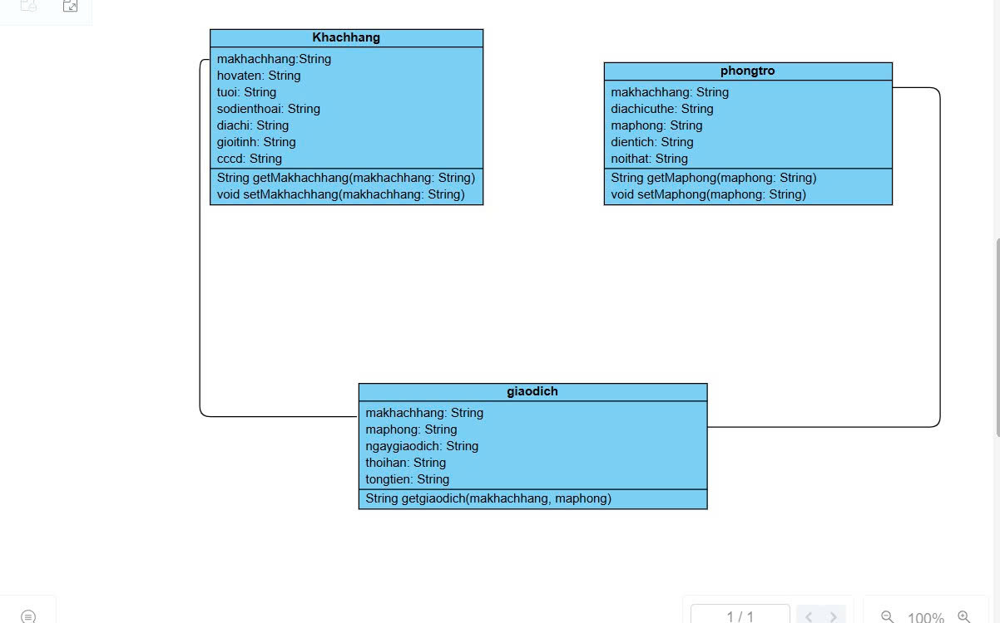
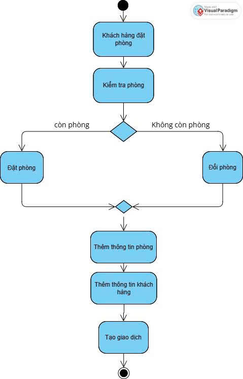
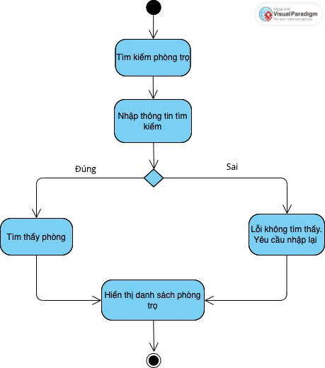
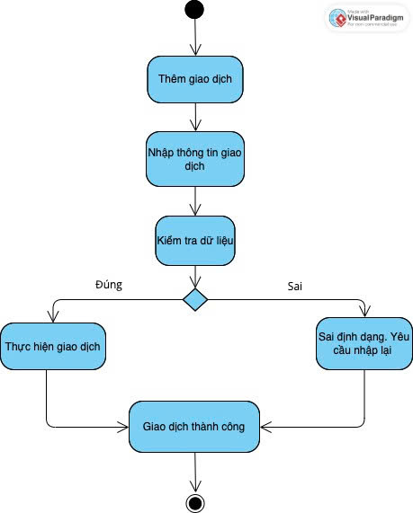
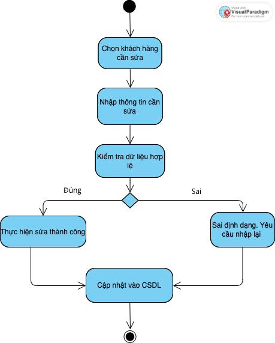
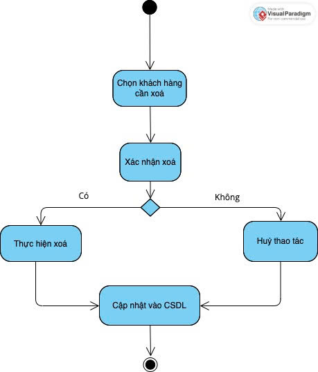

# Ứng dụng quản lý nhà trọ

# Sơ đồ chức năng

# Activity Diagram:

1.Đặt phòng trọ

2.Tìm kiếm phòng trọ

3.Thêm giao dịch

4.Sửa thông tin khách hàng

5.Xoá thông tin khách hàng

📌 Quản Lý Nhà Trọ
📖 Giới thiệu

Hệ thống Quản Lý Nhà Trọ là ứng dụng web hỗ trợ chủ trọ quản lý toàn bộ hoạt động cho thuê phòng một cách hiệu quả và chuyên nghiệp.
Các tính năng chính gồm:

Quản lý phòng trọ: thêm, sửa, xóa, cập nhật trạng thái phòng.

Quản lý khách thuê: thông tin cá nhân, hợp đồng, lịch sử thanh toán.

Quản lý hóa đơn: tính tiền điện, nước, dịch vụ, in hóa đơn.

Thống kê doanh thu và tình trạng phòng theo thời gian thực.

🎯 Mục tiêu dự án

Tối ưu hóa quy trình quản lý nhà trọ.

Giảm thiểu sai sót và tiết kiệm thời gian.

Dễ sử dụng, có thể truy cập từ mọi thiết bị.

📸 Giao diện
Trang đăng nhập

Trang quản lý phòng

Trang quản lý hóa đơn

📊 Chức năng chi tiết

Quản lý phòng trọ: thêm, sửa, xóa, tìm kiếm.

Quản lý khách thuê: lưu trữ thông tin, hợp đồng, nhắc hạn thanh toán.

Quản lý hóa đơn: tính toán tự động, in hóa đơn PDF.

Báo cáo thống kê: xuất file Excel/PDF.

# Thành viên:

Nguyễn Ngọc Diệp (MSV:24100250)

Nguyễn Thùy Dương (MSv: 24107946)

https://github.com/Diep710/OOP_N05_T3_2025_Group_Duong_Diep/commit/f17a1340389c6d600d8cfb8bd534bed8369df2f7

https://github.com/Diep710/OOP_N05_T3_2025_Group_Duong_Diep
